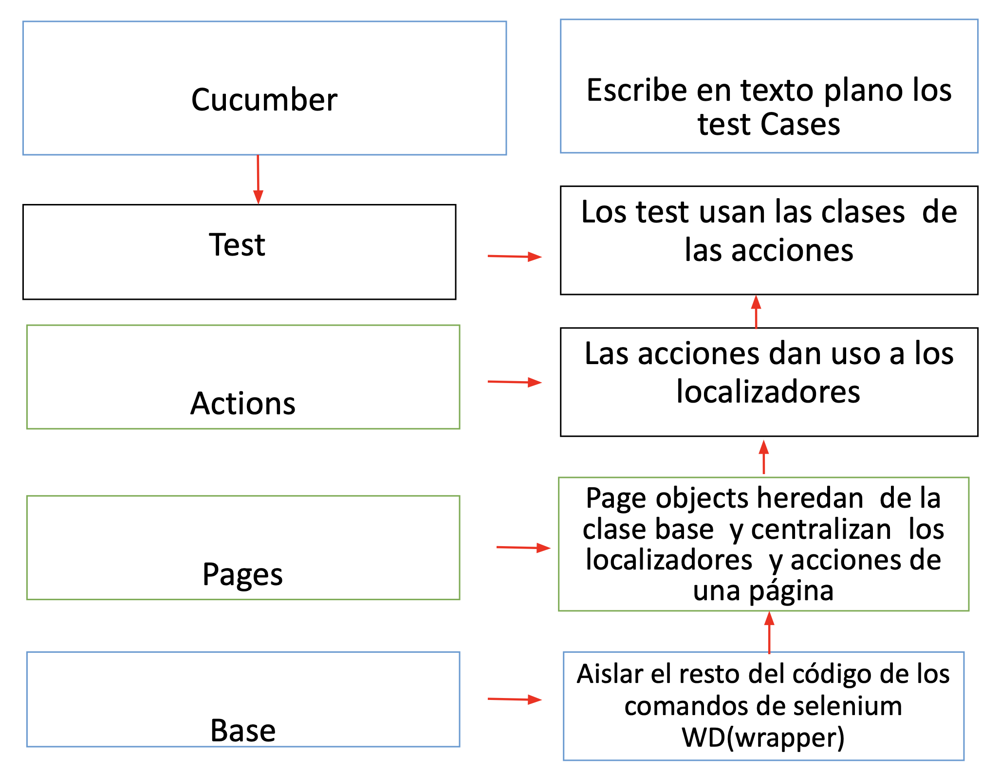
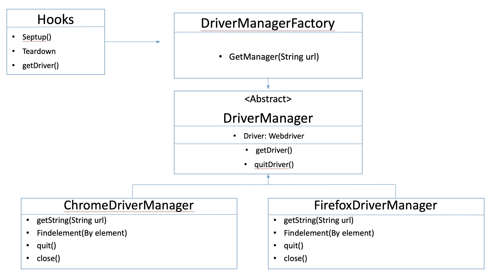

# selenium-cucumber-java
Para el siguiente desafio se utilizo: 
    -Cucumber
    -Java
    -Junit
    -Maven

El mismo fue creado con un driver de ios (Como mejora, se puede implementar el consumo de del driver a través de las librerías del chromedriver, así se evita que este condicionado en correr solo en mac.)

# Pasos para ejecutar el proyecto.
1- clonar el repositorio
2- dirigirse a la carpeta runner y ejecutar el testRunner que ya contiene el tag release
3- el proyecto puede ser ejecutado solamente de mac

# Estructura del proyecto

├── pom.xml
└── src
└── test
└── java
├── pom
│   ├── Page
│   │   ├── Page_1.java
│   │   ├── Page_n.java
│   ├── Actions
│   │   ├── Actions_1.java
│   │   ├── Actions_n.java
│   │────WebBase.java
│   ├── Runner
│   ├    ├──browser_manager
│   │           ├── ChromeDriverManager
│   │           ├── DriverManager
│   │           ├── DriverManagerFactory
│   │           ├── DriverType
│   │           └── FirefoxDriverManager
│   │    ├── StepDefinition
│   │           ├── Hooks.java
│   │           ├── Hooks.java
│   │           ├── StepDefinition_1.java
│   │           └── StepDefinition_n.java
└── resources
│   └── chromedriver
│   └── features
│   └── tessdata

# Estructura del proyecto basado en logica de manera descriptiva:
- Estructra del código de acciones y locator

- Estructra del código fuente de este proyecto

